# 角色操作教程

版本：v2  
更新时间：2026-06-21  
适用范围：活动报名 H5、管理后台、商城、多商家/代理、财务对账、文化大使招募

## 1. 系统入口

本地/预发常用入口按启动方式区分：

- Docker 本地后台和 H5：`http://127.0.0.1:18080/admin/`、`http://127.0.0.1:18080/`
- Vite 开发 H5：`http://127.0.0.1:5173/`
- Vite 开发后台：`http://127.0.0.1:5174/admin/login`
- API 健康检查：`http://127.0.0.1:3000/api/health`

默认后台账号仅用于本地验收：

```text
admin / Admin123456
```

正式上线前必须创建正式超级管理员，修改或禁用默认账号。

## 2. 全局业务流程

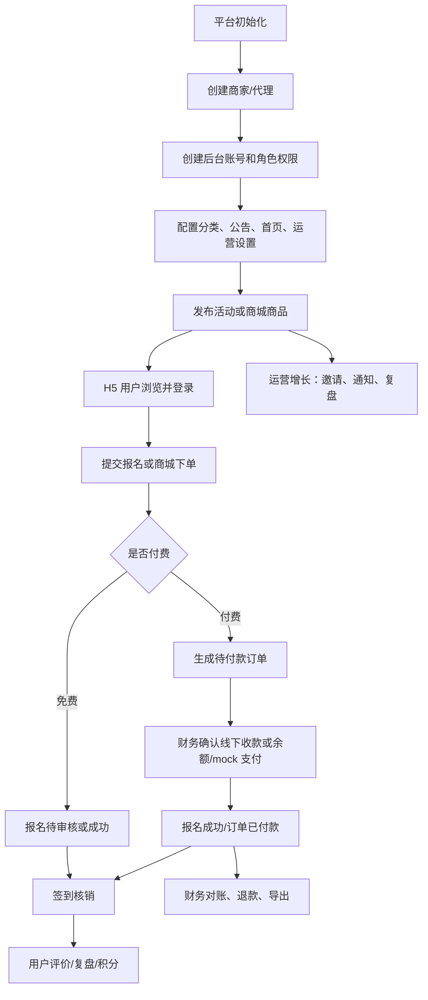

## 3. 角色总览

| 角色 | 主要入口 | 主要职责 | 不应操作 |
| --- | --- | --- | --- |
| H5 用户 | H5 首页、活动详情、我的报名、商城 | 浏览活动、报名、付款、查看签到码、评价、商城下单和售后 | 后台管理 |
| 平台超级管理员 | 管理后台全部菜单 | 商家开通、账号权限、系统设置、上线体检、平台监管、商城审核 | 日常多人共用同一账号 |
| 商家管理员 | 商家后台 | 维护本商家的活动、员工、运营设置、公告、首页、商城和数据 | 修改平台全局配置 |
| 运营人员 | 活动、报名、候补、公告、通知、评价、标签、会员 | 发布活动、审核报名、运营内容、增长触达 | 财务收款、退款、系统设置 |
| 财务人员 | 订单、财务对账、商城财务、结算 | 确认收款、处理退款、对账、导出、代理/商城结算 | 创建活动、修改系统设置 |
| 签到人员 | 签到核销、报名查询 | 现场核销签到码、查看必要活动和报名信息 | 审核报名、确认收款、退款 |
| 商城运营 | 商品、分类、营销、订单、物流、评价、统计、商城收款配置 | 管理商品、库存、订单履约、售后协同、营销工具、店铺收款资料草稿 | 平台商家授权、真实支付总开关 |
| 文化大使运营 | 文化大使招募 | 维护招募页、案例、申请线索和跟进状态 | 财务、系统设置 |

## 4. H5 用户操作教程

### 4.1 活动报名

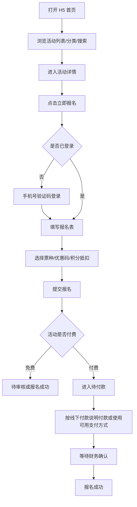

操作步骤：

1. 进入 H5 首页，查看推荐活动、分类和公告。
2. 打开活动详情，确认时间、地点、费用、名额、会员门槛和报名须知。
3. 点击报名；如未登录，使用手机号验证码登录。
4. 填写报名字段，付费活动可选择票种、优惠码和积分抵扣。
5. 免费活动提交后进入待审核或报名成功；付费活动提交后进入待付款。
6. 在报名详情查看状态、付款说明、签到码和退款状态。
7. 活动完成或签到后，可提交评价。

### 4.2 我的报名和签到码

1. 进入 H5 的“我的报名”。
2. 打开报名详情。
3. 确认报名状态：
   - `待审核`：等待后台审核。
   - `待付款`：按页面说明付款。
   - `报名成功`：可查看签到码。
   - `已签到`：可评价。
   - `已取消`：不能继续签到。
4. 到场后向工作人员展示签到码。

### 4.3 商城购物

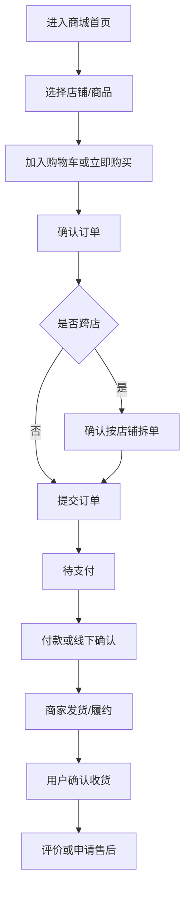

注意：

- 跨店购物会按店铺拆成多个子订单。
- 待支付订单可在订单列表或详情中继续支付。
- 订单详情会显示履约店铺，便于售后沟通。

## 5. 平台超级管理员操作教程

### 5.1 商家开通流程

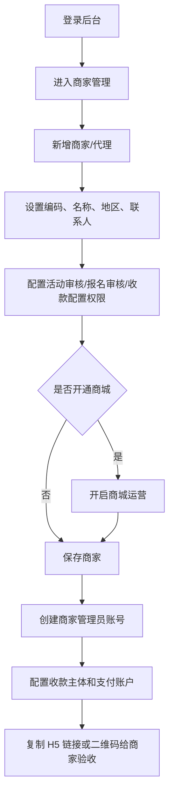

操作步骤：

1. 登录后台，进入“商家管理”。
2. 新增商家，填写商家编码、名称、地区、联系人和电话。
3. 根据合作模式选择权限：
   - 是否需要平台审核活动发布。
   - 是否开启报名审核。
   - 是否允许商家自维护收款配置。
   - 是否开通商城运营。
4. 保存后进入“管理员管理”，为商家创建管理员账号。
5. 如商家要收费或开商城，进入“代理收款/商城支付配置”补齐收款主体。
6. 复制商家 H5 链接或二维码，交给商家做首页、活动和商城预览。

### 5.2 账号和权限

1. 进入“管理员管理”。
2. 创建平台账号时不选择商家；创建商家后台账号时选择对应商家。
3. 选择角色：
   - 超级管理员：平台全局管理。
   - 运营：活动、报名、公告、通知、评价、会员等。
   - 财务：订单、收款、退款、对账和结算。
   - 签到：现场签到核销。
4. 保存后用该账号登录检查菜单是否符合权限。
5. 正式上线前禁用或修改默认 `admin / Admin123456`。

### 5.3 上线体检

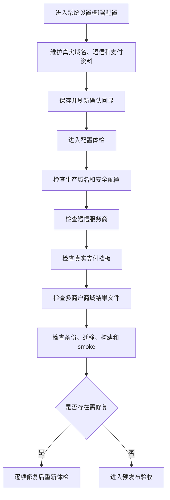

关键原则：

- 真实支付未完成预发验收前，不打开真实支付开关。
- 多商户商城必须保留有效的 smoke 结果文件。
- 生产短信需要真实服务商凭证、签名、模板和实发验证。

### 5.4 后台支付资料上传与上线验收

平台级真实支付和上线资料优先在“系统设置 / 部署配置”中维护，保存后会写入后台配置，并参与配置体检、商城支付 readiness 和真实支付运行时配置。`.env.production` 只作为首次部署引导和应急兜底。

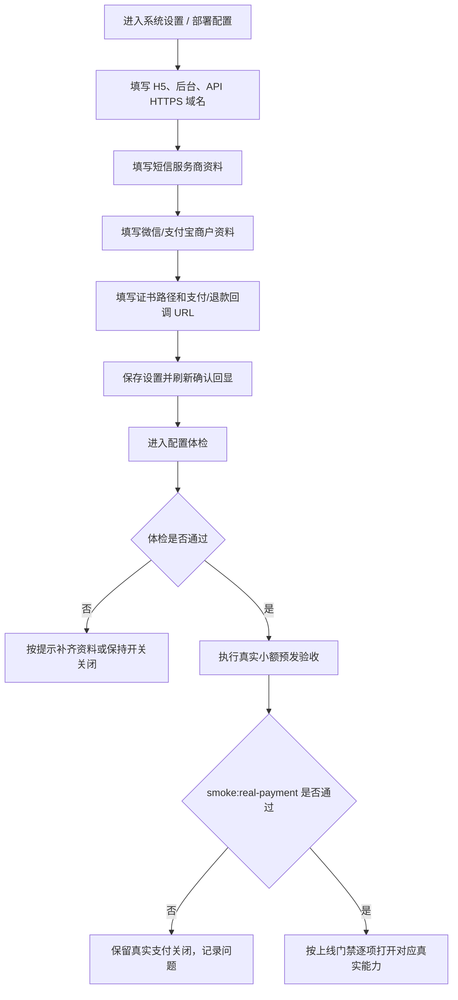

操作步骤：

1. 进入“系统设置 / 部署配置”。
2. 维护真实域名：
   - H5 域名：用户访问入口。
   - 后台域名：管理后台入口。
   - API 域名：支付回调、上传、接口调用入口。
3. 维护短信服务商资料：服务商、AccessKey、Secret、签名、模板 ID。
4. 维护微信/支付宝资料：
   - 微信 AppID、商户号、API v3 key、商户私钥路径、证书序列号、平台证书路径、支付回调 URL。
   - 支付宝 AppID、应用私钥路径、公钥证书路径、根证书路径、支付回调 URL。
5. 维护商城回调：
   - 平台代收支付回调：`/payment/mall/wechat/callback`。
   - 平台代收退款回调：`/payment/mall/wechat/refund-callback`。
   - 店铺直收支付回调模板：`/payment/mall/merchants/{merchantId}/wechat/callback`。
   - 店铺直收退款回调模板：`/payment/mall/merchants/{merchantId}/wechat/refund-callback`。
6. 保存设置后刷新页面，确认字段仍然回显。
7. 进入“配置体检”，确认域名、短信、支付挡板和预发结果状态。
8. 未完成真实证书和预发验收前，保持以下状态：
   - 真实支付：关闭。
   - 微信/支付宝真实支付：关闭。
   - 商城微信支付：未完成。
   - 店铺直收：未完成。
   - 预发通过：未通过。

验收标准：

- 后台部署配置保存后刷新可回显。
- 配置体检读取后台保存的域名和资料。
- 商城收款配置页读取后台商城回调 URL。
- 证书不可读取或预发未通过时，测试支付按钮必须锁定。
- 不得手动伪造 `deploy/real-payment-smoke-result.json`。

## 6. 商家管理员操作教程

### 6.1 商家日常配置

1. 登录商家后台。
2. 进入“商家资料”，维护名称、地区、联系人和联系电话。
3. 进入“运营设置”，维护：
   - 线下付款账户。
   - 付款备注要求。
   - 客服电话和客服微信。
   - 退款说明。
   - 发票说明。
4. 进入“公告管理”和“首页配置”，维护商家自己的公告和首页模块。
5. 保存后刷新 H5，确认展示正确。

### 6.2 员工账号

1. 进入“管理员管理”。
2. 为员工创建运营、财务或签到账号。
3. 商家后台不要创建平台账号或商家超级管理员以外的越权账号。
4. 创建后让员工登录一次，确认菜单和权限正确。

## 7. 运营人员操作教程

### 7.1 发布活动

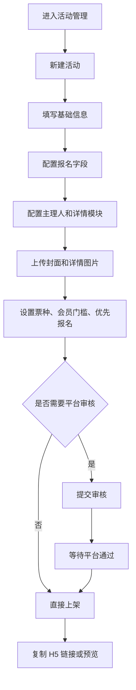

操作步骤：

1. 进入“活动管理”，点击新建。
2. 按步骤填写基础信息、报名字段、主理人和详情模块。
3. 上传封面和详情模块图片。
4. 免费活动费用填 0；付费活动设置费用、票种和优惠码。
5. 如需审核，提交平台审核；通过后活动对 H5 可见。
6. 上架后点击预览 H5，确认活动详情、报名按钮和图片展示正常。

### 7.2 报名审核

1. 进入“报名管理”。
2. 按活动、状态、手机号筛选。
3. 对待审核报名点击通过或拒绝。
4. 如需取消报名，确认活动规则和订单状态后再操作。
5. 审核后让用户刷新报名详情查看状态。

### 7.3 候补补位

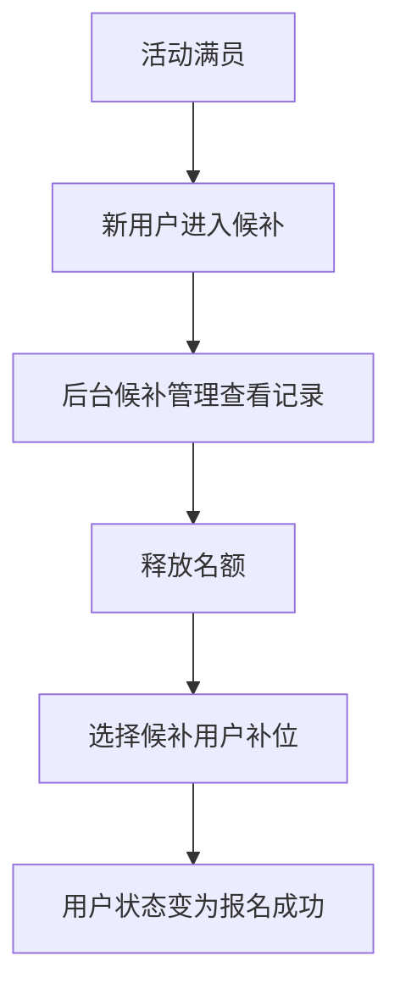

1. 进入“候补管理”。
2. 按活动查看等待中的候补用户。
3. 确认活动有可用名额。
4. 点击补位，补位后用户报名状态变为报名成功。

### 7.4 通知和复盘

1. 进入“通知中心”，选择模板和活动。
2. 发送活动提醒，或按用户标签批量发送分群通知。
3. 查看发送记录，失败记录可重试。
4. 活动结束后进入“活动复盘”，查看浏览、分享、报名、付款、签到和评价数据。
5. 如需汇报，导出复盘 Excel。

## 8. 财务人员操作教程

### 8.1 线下收款确认

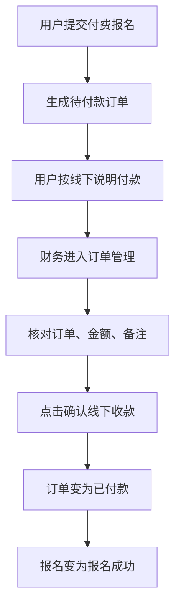

操作步骤：

1. 进入“订单管理”。
2. 按订单号、活动、用户手机号或状态筛选待付款订单。
3. 核对付款凭证、金额和备注。
4. 点击确认线下收款，填写收款备注。
5. 保存后订单变为已付款，报名变为报名成功。

### 8.2 退款处理

1. 进入“订单管理”或“财务对账”。
2. 对已付款或部分退款订单发起退款申请。
3. 财务在退款申请列表中审核：
   - 通过：按部分退款或全额退款更新状态。
   - 拒绝：订单和报名状态不变。
4. 全额退款会取消未签到报名并返还已使用积分。
5. 重复退款号不会重复扣减积分。

### 8.3 财务对账

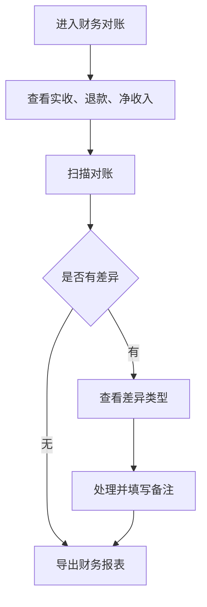

1. 进入“财务对账”。
2. 查看支付流水、退款申请、回调日志和对账差异。
3. 点击扫描对账，识别金额不一致、订单状态异常或回调异常。
4. 导入服务商账单后，未知订单和金额异常会进入差异列表。
5. 处理差异时填写处理备注。
6. 导出财务对账 Excel 留档。

### 8.4 代理结算

1. 进入“代理结算”。
2. 按代理和周期生成结算单。
3. 进入核对页查看实收、退款、净收入、佣金和应打款。
4. 如存在重算差异或待处理对账差异，不要打款。
5. 审核通过后可上传线下打款凭证。
6. 沙箱打款可演练成功和失败；失败只记录回执，不把结算单标记为已打款。

## 9. 签到人员操作教程

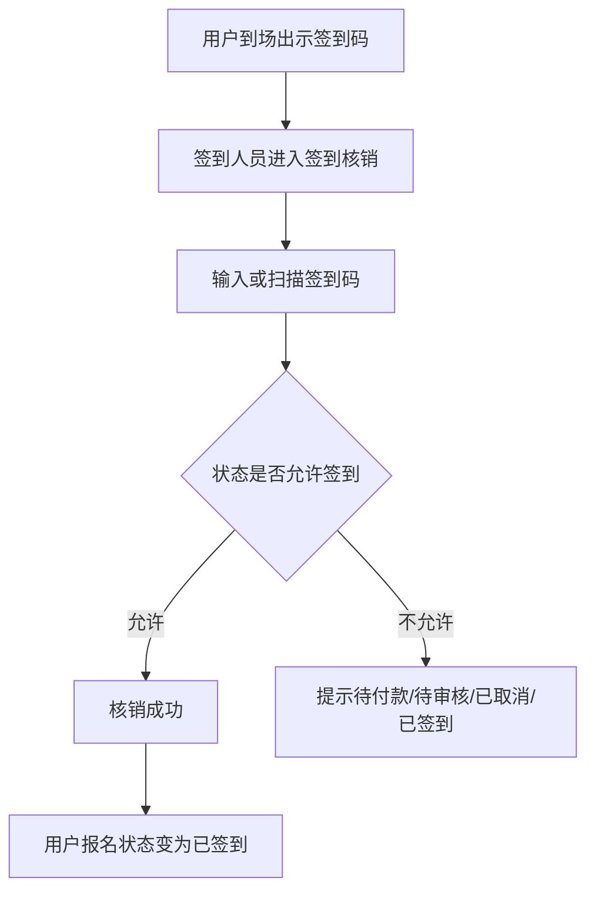

操作步骤：

1. 登录签到账号。
2. 进入“签到核销”。
3. 输入或扫描用户报名详情中的签到码。
4. 核对用户姓名、手机号和活动名称。
5. 点击核销。
6. 重复签到会提示已签到，不应再次核销。

签到人员不能确认收款、审核报名、退款或修改系统设置。

## 10. 商城运营操作教程

### 10.1 店铺和商品

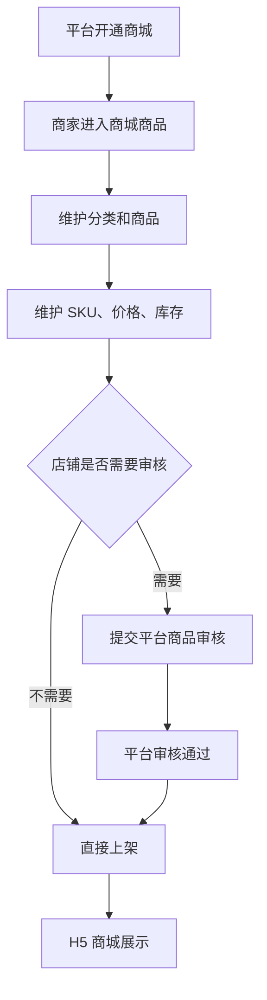

操作步骤：

1. 进入“商城分类”，维护分类。
2. 进入“商城商品”，新增商品、图片、介绍、SKU、价格和库存。
3. 需要审核的店铺提交商品审核。
4. 平台在“商城商品审核”中通过后，商品在 H5 店铺展示。
5. 使用“商城库存管理”查看低库存和库存流水。

### 10.2 订单履约

1. 进入“商城订单”。
2. 按店铺、订单状态、支付方式、结算组号筛选。
3. 已付款订单进行发货或线下履约。
4. 跨店订单按子订单分别履约。
5. 订单详情中查看履约店铺、支付状态、售后状态和物流信息。

### 10.3 售后和评价

1. 进入“商城售后管理”处理退款申请。
2. 查看用户凭证、退款渠道、失败原因和审核备注。
3. 通过、拒绝或重试退款前先确认订单和支付状态。
4. 进入“商城评价管理”审核评价，必要时填写商家回复。

### 10.4 营销和统计

1. 进入“商城营销”，创建优惠券、秒杀、拼团和推广码。
2. 活动价必须低于当前规格售价。
3. 同一店铺同一 SKU 的活动时间不要重叠。
4. 已产生订单或锁定库存后，不要修改活动识别字段。
5. 进入“商城统计看板”查看销售、订单、售后和库存指标。

### 10.5 商城收款资料上传与验收

商城收款配置用于店铺维护微信/支付宝收款资料，也用于平台检查商城支付是否可以开放。平台代收店铺可以先维护资料草稿；店铺直收必须完成独立回调和隔离验收后才能开放。

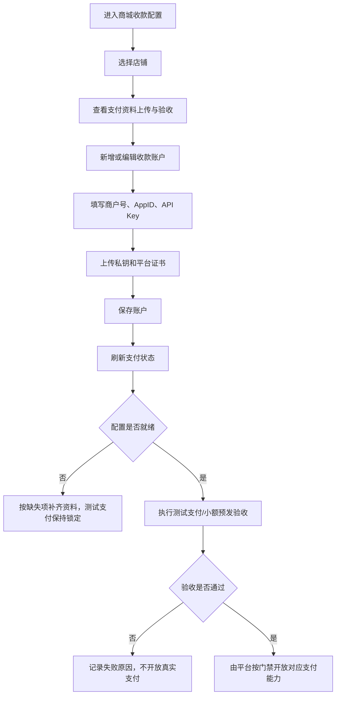

操作步骤：

1. 进入“商城收款配置”。
2. 选择当前店铺，确认店铺状态、收款模式和 readiness 提示。
3. 查看“支付资料上传与验收”：
   - 资料上传：检查账户资料是否完整。
   - 回调 URL 校验：支付和退款回调必须为 HTTPS，并指向商城专用路径。
   - 配置检测：显示当前阻断项。
   - 测试支付：未就绪时应为锁定状态。
   - 验收状态：未通过前不能开放真实支付或店铺直收。
4. 新增收款账户，选择微信支付或支付宝。
5. 填写商户名称、商户号、AppID、API key、证书序列号等字段。
6. 上传商户私钥、平台证书等文件；只上传服务端可读取的证书文件。
7. 保存后点击“刷新支付状态”。
8. 如果仍提示缺项，例如证书文件不可读取，继续补齐资料，不要点击或要求开放真实支付。
9. 真实小额预发验收通过后，由平台超级管理员按上线门禁打开对应开关。

注意事项：

- “配置未就绪”不是页面错误，而是上线挡板正常工作。
- 平台代收使用平台商城回调；店铺直收必须使用包含 `{merchantId}` 的回调路径，防止串店。
- 测试支付锁定时，不要通过修改数据库或结果文件绕过。
- 商城支付资料可以先保存为停用草稿，等真实资料齐全后再启用。

## 11. 文化大使运营操作教程

适用于平台侧“文化大使招募”页面。

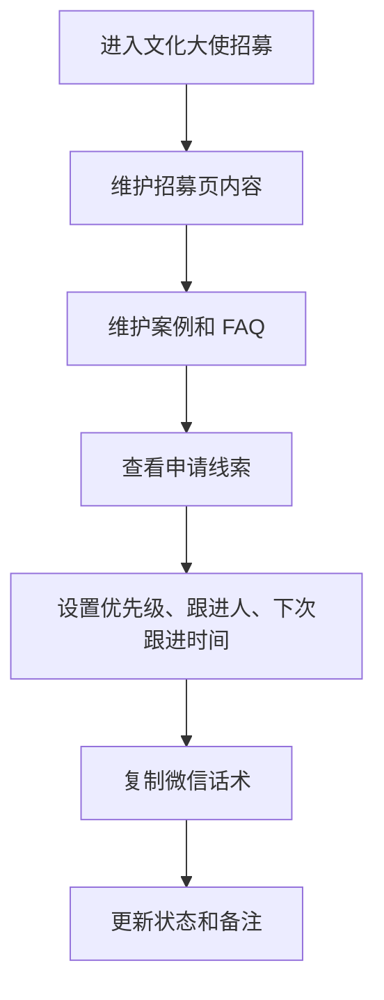

操作步骤：

1. 进入“文化大使招募”。
2. 维护页面模块、权益说明、招募流程和 FAQ。
3. 新增或编辑案例。
4. 在申请列表中查看申请人、联系方式和来源。
5. 设置优先级、跟进人、下次跟进时间和状态。
6. 点击复制话术，用于微信或电话跟进。
7. 跟进后及时更新备注。

## 12. 日常巡检建议

每日：

- 检查 API `/api/health/ready`。
- 检查报名通道是否处于预期状态。
- 查看待审核报名、待付款订单、待处理退款和异常回调。
- 查看验证码异常发送量。

每周：

- 抽查运营、财务、签到账号权限。
- 抽查操作日志和后台登录失败记录。
- 抽样验证免费报名、付费线下收款、签到、评价和导出。
- 抽查商城订单、售后、库存、结算和评价。

每月：

- 做一次数据库恢复演练。
- 检查短信、邮件、微信通知服务商余额和模板状态。
- 检查默认管理员是否已禁用或更换。

## 13. 常见异常处理

| 异常 | 处理方式 |
| --- | --- |
| 用户收不到验证码 | 检查 H5 验证码日志、短信服务商状态、手机号/IP 限流 |
| 用户无法报名 | 检查活动状态、报名时间、名额、会员门槛、优先报名规则、报名开关 |
| 付费报名未成功 | 检查订单是否待付款、财务是否确认线下收款、支付流水是否异常 |
| 签到失败 | 检查报名状态是否待审核、待付款、已取消或已签到 |
| 退款无法处理 | 检查订单状态、可退金额、是否已有处理中退款 |
| 商城商品不展示 | 检查店铺是否启用、商城是否开通、商品是否上架或审核通过 |
| 商城订单无法发货 | 检查订单是否已付款、店铺权限和库存状态 |
| 财务对账有差异 | 进入财务对账查看差异类型，核对服务商账单和本地订单 |
| 商城测试支付被锁定 | 进入商城收款配置查看 readiness；通常是商户资料、证书文件、回调 URL 或预发状态未就绪 |
| 真实支付不可用 | 检查后台部署配置、真实支付开关、商户证书、回调 URL、预发结果文件；未验收前不要打开 |

## 14. 上线前必须确认

上线真实公网前必须满足：

- 真实 HTTPS 域名、反向代理和安全响应头完成。
- 正式超级管理员已创建，默认管理员已改密或禁用。
- 生产短信服务商凭证、签名、模板和实发验证通过。
- 后台“系统设置 / 部署配置”已保存真实 H5、后台、API 域名和支付/短信资料，并刷新确认回显。
- 商城收款配置页支付/退款回调 URL 校验通过，证书文件可读取。
- `npm run build`、`npm run test`、`npm run preflight`、`npm run smoke`、`npm run smoke:flow` 通过。
- 数据库备份、清理和恢复演练可执行。
- 浏览器主流程和各角色流程通过。
- 如开放多商户商城，`smoke:mall-multi-merchant` 结果有效且 `passed=true`。
- 如开放真实支付，`smoke:real-payment` 和 `prelaunch:online-showcase` 必须通过，真实支付证据不得伪造。
